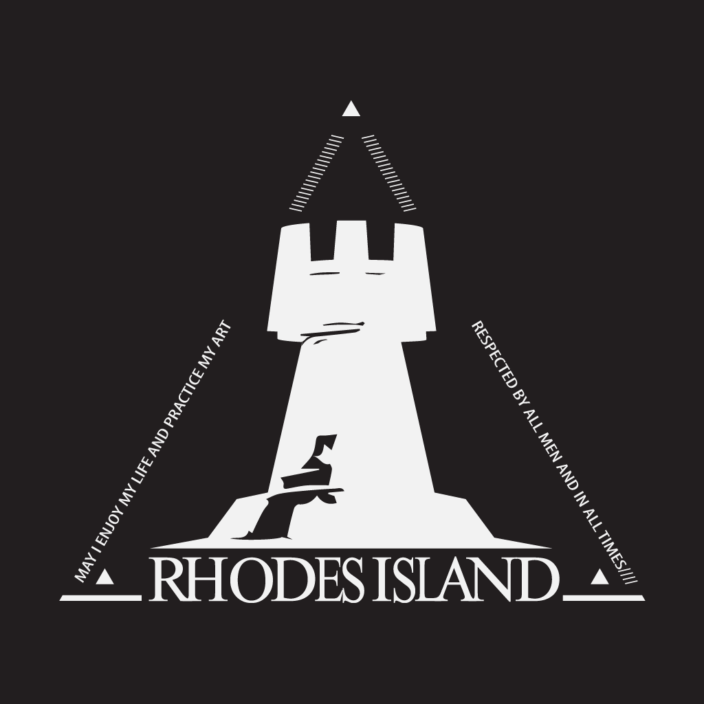

<p align="center">
  <picture>
    
  </picture>
  <h1 align="center">Rhodes Console</h1>
</p>

Chrome Extension for Arknights fans. New tab screen will be changed.

**Notice: This plugin is fan-made and not official. It is a work in progress and features may be subject to destructive changes
or removal without notice.**

## Features

- [x] Random Background
- [ ] Language selector
- [ ] Logo animation
- [ ] Particles animation
- [ ] Random Operator
    - [ ] standing picture
    - [ ] voice
- [ ] Greetings to <doctor's name>
- [ ] Latest news
- [ ] Currently active event

If there are other features you would like to see implemented, please let us know in
the [discussions](https://github.com/kerthical/rhodes_console/discussions).

## Installation

### From Chrome web store

1. Go to [Chrome Web Store](https://chrome.google.com/webstore/detail/todo)
2. Click "Add to Chrome"
3. Click "Add extension"
4. Enjoy!

### From releases

1. Download the latest release from [here](https://github.com/kerthical/rhodes_console/releases/latest)
2. Unzip the file
3. Go to `chrome://extensions/`
4. Enable "Developer mode"
5. Click "Load unpacked"
6. Select the folder you just unzipped
7. Enjoy!

### From source code

```bash
git clone https://github.com/kerthical/rhodes_console
cd rhodes_console
npm install
npm run build
```

The extension will be built in `./packages/extension/build/dist` folder. You can load it in Chrome by following the
steps in the previous section.

## Contributing

Contributions are welcome! Please read [CONTRIBUTING.md](CONTRIBUTING.md) for details on our code of conduct, and the
process for submitting pull requests to us.

## Authors

- **Kerthical** - *Initial work* - [Kerthical](https://github.com/kerthical)

## License

This project is licensed under the WTFPL License - see the [LICENSE](LICENSE) file for details